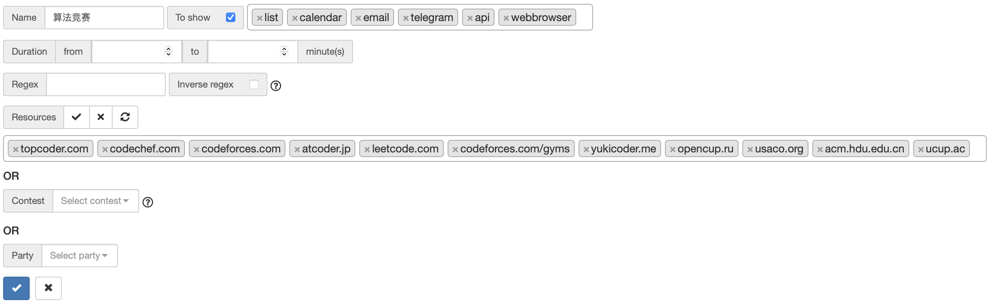

# 算法竞赛开赛提醒

支持[Codeforces](https://codeforces.com/),[Atcode](https://atcoder.jp),[牛客](https://ac.nowcoder.com/acm/home)等众多平台的赛前提醒

会在比赛开始前一小时将比赛信息和链接推送到群上。

代码来源于[QQ小明机器人插件](https://github.com/bobby285271/xiaoming-bot)

对服务端代码重构，适配[Hoshinobot](https://github.com/Ice-Cirno/HoshinoBot).

## 更新日志

### 2023.6.15

修复`今日比赛`出现明天的比赛的问题。

### 2023.6.12

支持`洛谷月报`。

### 2023.5.24

持久化储存`find`结果。

增加频率限制。

### 2023.5.23

移除`group.json`，改用`server`的方式开关定时提醒。

`find`结果改为转发消息，防止刷屏。错误消息采用`回复`功能。

### 2023.5.21

数据源更改为[clist](https://clist.by)，需自行注册帐号，然后在[api文档](https://clist.by/api/v3/doc/)里点击`show my api-key`，复制`Param query`的内容，填写在`api.py`的`apikey`中，将开头的`/?`替换成`&`。

因为`clist`有收录了很多比赛，包括`ctf`比赛，可以在[filters](https://clist.by/settings/filters/)设置过滤规则，这样`api`返回结果里仅包含这些比赛信息了。比如算法竞赛的可以选择以下网址。



## 安装方法

在```HoshinoBot\hoshino\modules```目录下使用以下命令拉取本项目

```
git clone https://github.com/Lanly109/CodingReminder.git
```

进入该目录后使用如下命令安装依赖

```
cd CodingReminder
pip install -r requirements.txt
```

然后在```HoshinoBot\hoshino\config\__bot__.py```文件的```MODULES_ON```加入```CodingReminder```


## 使用方法

- 输入以下关键字获得比赛咨询：cf 牛客 atcoder ucup yukicoder leetcode codechef topcoder ctf
- [今日比赛] 获取今日未举行的比赛
- [明日比赛] 获取明日比赛
- [当前比赛] 获取当前进行的比赛
- find tourist (查找tourist cf信息) 
- [洛谷月报 xxxx-xx] 获得xxxx年xx月的洛谷月报，省略则获得最新月报
- [随机月报] 随机获得一份洛谷月报
